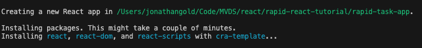
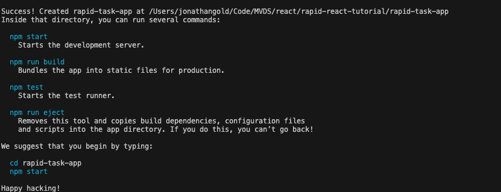

# **Rapid React Part 1: Getting Started**

Let’s face it: if you want to make it in the world of web development, either as a Frontend or full-stack developer, you really need to know React. This series is aimed to get you up and running, building your React-based web apps as rapidly as possible with a series of short and focused articles. In this installment, I will give you a brief introduction to React and how to create your first React project. The sample code for this installment is available on [Github](https://github.com/trider/rapid-react-tutorial/tree/0700c8e2cb86379c44c2939b75b70e308451e76c/react-task-tutorial-01).

## **What is React**

[React](https://react.dev/) lets you build [single-page web applications](https://www.bloomreach.com/en/blog/what-is-a-single-page-application#:~:text=A%20single%20page%20application%20is,browser%20loading%20entire%20new%20pages.) (SPA). These dynamically load content and display it using a single HTML page. This page acts as a container or master page that presents the individual pages of your web app and lets you navigate between them. The SPA fetches data from the server and interacts with users locally within the browser, thus providing a faster and more responsive user experience than equivalent server-side apps.

React was designed to be a fast and responsive web application development platform. To this end, It is delivered as a compact library that gives you the features you need most. This contrasts with frameworks like Angular, which attempt to provide a complete all-in-one solution. The good news is that React has an extensive ecosystem of add-ins that provide anything your project needs.

## **Getting Started**

Now let’s dive in and create our first project. In line with React’s lightweight design philosophy, there’s no Command Line Interface. So, before we can get started, will need to install [Create React App](https://github.com/facebook/create-react-app).

Next, we need to create our React app with the create-react-app command. Open a terminal window, and type the following.

```bash
npx create-react-app react-task-app
```

The launches the process and asks you if you want to proceed.


Then, it takes care of the rest.



When it’s work is done, you will see this.



All you need now is to open and run the app. At the command open,

```bash
cd rapid-react-tutorial 
npm start
```

The following is displayed.


A browser window opens and displays this:


## **Conclusion and What’s Next**

Since this series is called Rapid React, this installment kicked things off as fast as possible. After a brief introduction to ReactJS, we created and ran a boilerplate project. In the Next installment, we will start building out a Task Management web app. See you then.
