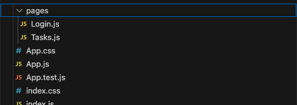

# **Rapid React Part 3: User Interaction and Forms**

In [Part Two](https://www.linkedin.com/pulse/rapid-react-part-2-creating-linking-pages-jonathan-gold-gc6cf/) of this series, we introduced you to the theory and practice of creating pages with JSX and how to navigate between them. Now we have a foundation in place, we can build on it and add some basic functionality. In this article, we will add a form to the Login page. The sample code for this installment is available on [GitHub](https://github.com/trider/rapid-react-tutorial/tree/0700c8e2cb86379c44c2939b75b70e308451e76c/react-task-tutorial-03).

## **Key Concepts**

In this installment, we introduce the concepts of components, hooks, and state.

### **Components**

React enables you to modularize your application code into reusable components. In React terms, our pages (Login.js and Tasks.js) are components.



For example, here is the code of our Login component. This is what is known as a functional component because it uses a function to display JSX code.

```javascript
const Login = () => {
 return (
   <div>
     <h1>Login</h1>
     <p>Part 1: The Basics</p>
   </div>
 );
}

export default Login;
```

### **Hooks**

In addition to functional components, React also supports class components. These have several advantages over functional components but also add a level of complexity. Until recently, they also supported a number of valuable features that were not available to functional components, Recently, React introduced a mechanism called hooks. Hooks simplify component logic, making it easier to share and reuse code across components.

### **State Management**

Using hooks, we can create a form that collects data and manages user interactions. The data stored and managed by a component is called state. In React, data collected by an application is called local state. To manage and store local state, add a reference to React’s useState Hook.

## **Creating the Login Form**

Our first task is to create a Login Form. The form enables a user to type an email and password. When the user presses the Submit button, the app checks the submitted credentials and authenticates the user. If the user’s credentials are valid, the application displays a message and navigates to the task page.


Open Login.js (src/pages/Login.js). First, we will add the following references. The first reference is the file with our list of users. The last file is a CSS template. Both these files can be downloaded from GitHub.

```javascript
import Users from '../data/users';
import './_pages.css';
```

Now, let’s add the necessary data to display a form.

```javascript
const Login = () => {
  return (
   <div className="card">
     <h1>Part 2:Login</h1>
      <form>
       <label>Email</label>
       <input
         type="email"
         name="username" 
         placeholder="Enter email"/><br/>
       <label>Password</label>
        <input
         type="password"
         name="password" 
         placeholder="Password"/><br/>
       <button type="submit">Login</button>
     </form>
   </div>
 );
}
```

## **Managing Local State**

Now that we have a form, we need a mechanism for collecting data and managing user interactions. In React, data collected by an application is called local state. To manage and store local state, add a reference to React’s useState Hook.

```javascript
import { useState } from 'react';
```

In the Login() function, we declare variables to store the local state of the user’s credentials (email, password) and authenticated user profile. Each state variable is an array with two elements. The first element is the variable name that stores a local state value, such as email. The second is a reference to a function that updates the state using useState, such as setEmail.

```javascript
const Login = () => {
 const [email, setEmail] = useState("");
 const [password, setPassword] = useState("");
 const [user, setUser] = useState();
 …
}
```

## **UseState in Action**

After we have declared our state variables, we can use them to collect and display form data. Here, when a user enters or changes values in the Email field, an event (e) is triggered. The event updates email by calling setEmail. When the value has been updated, the field’s value parameter displays the new local state of email.

```html
<label>Email</label>
  <input
      type="email"
      name="username" 
      placeholder="Enter email"
      value={email}
      onChange={(e) => setEmail(e.target.value)} />
    <br/>
    <label>Password</label>
    <input
      type="password"
      name="password" 
      placeholder="Password"
      value={password}
      onChange={(e) => setPassword(e.target.value)}/>
```

## **Submitting and Reacting to Form Data**

Once we have a working form, we need a way to submit and authenticate the data. In this case, we need to add an onSubmit event that is triggered when the user clicks the Submit button. To ensure that the onSubmit event is not triggered each time the page loads or reloads, we add the e.preventDefault() method.

```html
 <form onSubmit={(e) => {
 e.preventDefault();
 const currUser = Users.find((user) => 
   user.email === email && user.password === password);
    if(currUser){
      alert(`Email: ${email}\nPassword: ${password}`);
      setUser(currUser)
    }
 }} >
```

When the user submits their credentials, the function declares a value called currentUser. currentUser queries the list of users and matches the supplied credentials. If the query matches a single user, a message is displayed. Then, setUser is called to add the profile to the component’s local state. Since the default value of the local state’s user object is Null, once it is updated with valid data, the function can display the Tasks page.

```html
<div className="card">
     <h1>Part 2:Login</h1>
     {user && (
       <Navigate to="/tasks" replace={true} />
     )}
    <form onSubmit={(e) => {
     …
```

## **Conclusion and What’s Next**

In this installment, we learned about React components, hooks, and local state. We created a form and added logic to perform basic authentication. In the next installment, we will update the Tasks page to display a list of tasks.
