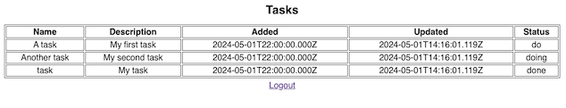
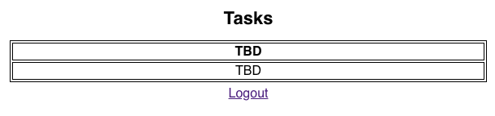
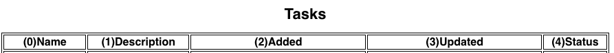

# **Rapid React Part 4: Presenting Data**

In [Part 3](https://www.linkedin.com/pulse/rapid-react-part-3-user-interaction-forms-jonathan-gold-1gp0f/), we learned about React components, hooks, and local state. We created a form and added logic to perform basic authentication. In this installment, we will add a table to the page and display a list of tasks assigned to the user. The sample code for this installment is available on [GitHub](https://github.com/trider/rapid-react-tutorial/tree/6d3694bb4b5fe1a53d45c7e798339cd2bc91f30f/rapid-react-tutorial-04).



## **Key Concepts**

In this installment, we introduce the concepts of the Virtual DOM, Keys, and Interpolation.

### **Virtual DOM**

As this installment covers using React to present data, we should take a look at the [Virtual DOM](https://www.freecodecamp.org/news/what-is-the-virtual-dom-in-react/). This is an in-memory representation of your web browser's Document Object Model (DOM), a tree structure with nodes that represent elements on a web page. Unlike the actual DOM, which rerenders the entire page in response to external changes, the Virtual DOM only updates those elements that change. The Virtual DOM and JSX are closely related and help ensure a consistent and improved user experience.

### **Keys**

When it comes to displaying lists with React, it is also important to understand keys. A key is an identifier applied to items in a list. It helps React identify which elements have been added, changed, or removed from a list. In the following example, the function displays items in a list of fruits as an unordered (bullet) list.

```javascript
const MyList = () => {
  const fruit = ['Apple', 'Banana', 'Cherry'];
  return (
    <ul>
      {fruit.map((item, index) => (
        <li key={index}>{item}</li>
      ))}
    </ul>
  );
};

```

Keys help React manage dynamic lists efficiently and prevent errors by ensuring that each element can be uniquely identified.

### **Interpolation**

Interpolation is the method by which you can inject static text with dynamic elements. React supports interpolation by surrounding a variable with a pair of braces. See above for an example. Another way to interpolate text is to use the following syntax.

```javascript
`${task.id}`
```

This syntax is useful when you want to combine multiple variables into a single string. We will use this form of interpolation to create keys for each table body cell.

## **Referencing Data Sources**

Open src/Tasks.js. At the top of the page, let’s add references to two data sources. The first reference is to the file col.js which contains a list of table (tableCols) columns. The second is to the file tasks.js which contains a list of tasks that populate the table.

```javascript
import { Link } from "react-router-dom";
import tableCols from "../data/cols";
import userTasks from "../data/tasks";
import "./_pages.css";
```

## **Structuring the Page**

Currently, all we have on our Tasks page is some boilerplate text and a link.

```javascript
const Tasks = () => {
 return (
   <div>
     <h1>Tasks</h1>
     <p>TBD</p>
     <Link to="/">Go to login</Link>
   </div>
 );
}
```

Let’s start by adding a table to the page.

```javascript
const Tasks = () => {
 return (
   <div>
     <h1>Tasks</h1>
     <table>
       <thead>
         <tr><th>TBD</th></tr>
       </thead>
       <tbody>
         <tr><td>TBD</td></tr>
       </tbody>
     </table>
     <p><Link to="/">Logout</Link></p>
   </div>
 );
};
export default Tasks;
```

Refresh the page and the following is displayed.



## **Adding Table Columns**

Our next step is to add a row of column headers to the table. Replace the code in the table header with the following:

```html
<thead>
 <tr>
  {tableCols.map((col, index) => (<th key={index}>{index}{col}</th>))}
</tr>
</thead>
```

Here, we iterate through tableCols using the map method. Note how we use an index to assign a unique key to each column. Refresh the page, and the following will be displayed.



Before we proceed, remove the index from the body of the column header.

```html
<thead>
  <tr>
    {tableCols.map((col, index) => (<th key={index}>{col}</th>))}
  </tr>
</thead>
```

## **Populating the Table with Data**

The final step is to populate the table with task data. First, we will iterate through our list of tasks to create each row of the table.

```html
<tbody>{userTasks.map((task) =>(
  <tr key={task.id}>{tableCols.map((col) => (</tr> )
 )}
</tbody>
```

The easiest way to display task data would be to hardcode the name of each field in for each table cell (\<td\>).

```html
<tr key={task.id}>
 <td>{task.name}</td>
 <td>{task.description}</td>
 <td>{task.added}</td>
 <td>{task.updated}</td>
 <td>{task.status}</td>
</tr>
```

The problem with this approach is that any changes to our data source could prevent the display or even break our table. In addition, if we want to add new cells to the table, we will have to add them manually. Instead, we will take advantage of the fact that our list of column names matches the fields of each task object in the tasks list (array). This will populate each cell dynamically. However, for this to work, we also need to convert the name of each column to lowercase. Note how we use text interpolation to create a unique composite key.

```javascript
<tr key={task.id}>
 {tableCols.map((col, index) => (
    <td key={`${col}-${task.id}-${index}`}>{task[col.toLowerCase()]}</td>))}
</tr>))}
```

Refresh the page, and the following will be displayed.


## **Conclusion and What’s Next**

In this installment, we introduced you to the concepts of the Virtual DOM, Keys, and Interpolation. We used these ideas to populate a table with task data dynamically. In the next installment, we will look at how to improve our app's appearance with theming.
