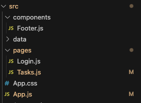
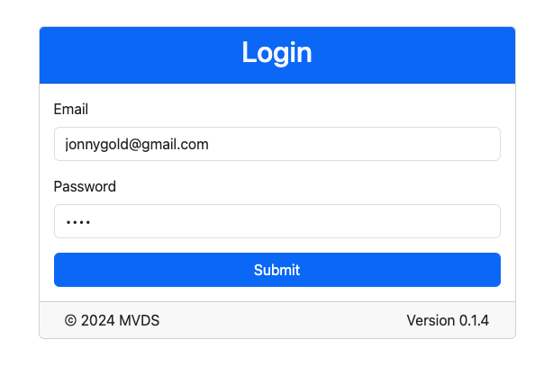
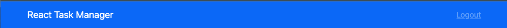

# **Rapid React Part 5: Styling React**

In [Part 4](https://www.linkedin.com/pulse/rapid-react-part-4-presenting-data-jonathan-gold-fn6cf/), concepts of the Virtual DOM, Keys, and Interpolation. We used these ideas to populate a table with task data dynamically. At this point, our code is functional, but our pages could be prettier. Let’s face it: most developers, myself included, are not web designers, so we need some help from that department. The good news is that we don’t have to be, and there are a number of available solutions. In this installment, we dive into one of those solutions and investigate how we can use Bootstrap to make our app look and feel more professional. The sample code for this installment is available on [GitHub](https://github.com/trider/rapid-react-tutorial/tree/76624d7d8df10986c6152f5b2a85b503e4255751/rapid-react-tutorial-05).

## **Key Concepts**

In this section, we provide background and context on CSS and Bootstrap.

### **CSS**

[Cascading Style Sheets (CSS)](https://developer.mozilla.org/en-US/docs/Web/CSS) is a language for managing the appearance of web pages. It allows you to separate the presentation of those pages from its underlying (HTML) content. CSS defines selectors that map to individual HTML elements. For each element, you can set properties (attributes) and the values to set for the properties. In the following example, we set the color and weight of a top-level heading (H1) element.

```css
h1 {
    color:red;
    font-weight: bold;
}
```

In addition to mapping to HTML elements, you can create class selectors that apply to a group of elements. You can also target specific elements by creating ID selectors.

### **Bootstrap**

[Bootstrap](https://getbootstrap.com/) is a popular, flexible, and easy-to-use CSS framework. It was originally created by Twitter and made available as an open-source project. Bootstrap was designed to operate with Javascript, and specific versions are available for popular frameworks, such as React, Angular, and Vue.js. We will be using [React Bootstrap](https://react-bootstrap.netlify.app/docs/getting-started/introduction).

## **Getting Started with Bootstrap**

To use Bootstrap, we first install the React Bootstrap package. In your IDE’s integrated terminal, type:

```bash
npm install react-bootstrap bootstrap
```

Next, open App.js. Remove or comment out the reference to App.css. Instead, add the following reference:

```javascript
import "bootstrap/dist/css/bootstrap.min.css";
import { BrowserRouter, Routes, Route } from "react-router-dom";
```

## **Creating Reusable Page Components**

Bootstrap lets you create reusable components that you can within each page of your app. For our first page component, we will create a footer that displays copyright and version information. The footer will appear on both the Login and Tasks pages. ![][image1]

In the src folder, create a new folder called components. In the folder, create a new file called Footer.js



Our footer will be based on a standard HTML footer and will include three Bootstrap elements: Container, Row, and Col. Containers define an area that contains elements for positioning within the viewport (display) of your browser or device. Row is a row element that can be divided up into columns (cols) or equal or varying but uniform sizes. In Footer.js, add the following code. Note that React Bootstrap elements are capitalized.

```javascript
import Container from "react-bootstrap/Container";
import Row from "react-bootstrap/Row";
import Col from "react-bootstrap/Col";

const Footer = () => {
 return (
   <footer>
     <Container>
       <Row>
         <Col sm={8}>&copy; 2024 MVDS</Col>
         <Col style={{ textAlign: "right" }}>Version 0.1.4</Col>
       </Row>
     </Container>
   </footer>
 );
};

export default Footer;
```

## **Modifying Login.js with Cards and Forms**

Open src/pages/Login.js. At the top of the page, add references to Bootstrap’s Button, Container, Form, and Card components and our Footer component.

```javascript
import Container from "react-bootstrap/Container";
import Row from "react-bootstrap/Row";
import Col from "react-bootstrap/Col";


const Footer = () => {
 return (
   <footer>
     <Container>
       <Row>
         <Col sm={8}>&copy; 2024 MVDS</Col>
         <Col style={{ textAlign: "right" }}>Version 0.1.4</Col>
       </Row>
     </Container>
   </footer>
 );
};

export default Footer;
```

Next, we will divide our Login page into two components. The existing Login component will be a Container element that displays a card with a header and footer. For now, the header will display a hard-coded title. The card footer displays our Footer component. The card’s main (body) section will reference a form component.

First, copy the Login function and call it FormBody. Next, replace the return section of Login with the following.

```javascript
const Login = () => {
 return (
   <div>
     <Container fluid className='container-lg' 
       style={{ marginTop: '100px', width: '40%' }}>
       <Card className='card-sm'>
         <Card.Header className='bg-primary text-light text-center' >
           <h2>Login</h2>
         </Card.Header>
         <Card.Body>
           <FormBody />
         </Card.Body>
        <Card.Footer>
         <Footer />
        </Card.Footer>
       </Card>
     </Container>
   </div>
 );
}
```

Now, let’s restyle our Login form to use Bootstrap form components and styling.

```javascript
const FormBody = () => {
 const [email, setEmail] = useState("jonnygold@gmail.com");
 const [password, setPassword] = useState("1234");
 const [user, setUser] = useState();
 return (
   <div>{user && (<Navigate to="/tasks" replace={true} />)}
     <Form onSubmit={(e) => {
       e.preventDefault();
       const currUser = Users.find((user) => 
       user.email === email && user.password === password);
       if(currUser){
         setUser(currUser);
       }
       else{
         alert("Invalid email or password");
       }
     }} >
       <Form.Group className="mb-3" controlId="formBasicEmail">
         <Form.Label>Email</Form.Label>
         <Form.Control
           type="email"
           placeholder="Enter email"
           value={email}
           onChange={(e) => setEmail(e.target.value)}
         />
       </Form.Group>
       <Form.Group className="mb-3" controlId="formBasicPassword">
         <Form.Label>Password</Form.Label>
         <Form.Control
           type="password"
           placeholder="Password"
           value={password}
           onChange={(e) => setPassword(e.target.value)}
         />
       </Form.Group>
       <div className="d-grid gap-2">
         <Button variant="primary" type="submit" >Submit</Button>
       </div>
     </Form>
   </div>
 );
}
```

Refresh the page, and it should look like this:



## **Creating a Navigation Bar**

Before we update the Tasks page, we will create a Navigation bar component. This will be located at the top of the page, display the app's name, and let us return to the Login page. 



In src/components, create a file called Navigation.js. Open the file and add references to the Container, Navbar, and Nav Bootstrap components. The Navbar is the parent Navigation component that contains individual Nav elements, such as links and buttons. After the Bootstrap components, include a link to the React Routers Link component. This lets us navigate back to the Login page.

```javascript
import Container from 'react-bootstrap/Container';
import Navbar from 'react-bootstrap/Navbar';
import Nav from 'react-bootstrap/Nav';


import {Link as ReactLink} from "react-router-dom";
```

Now, add the following code to create the Navbar component.

```javascript
const NavbarComponent = () => {
 return (
   <Navbar bg="primary" expand="lg" data-bs-theme="dark">
     <Container>
       <Navbar.Brand href="#home">React Task Manager</Navbar.Brand>
       <Navbar.Toggle aria-controls="basic-navbar-nav" />
       <Navbar.Collapse id="basic-navbar-nav">
         <Nav className="me-auto" ></Nav>
         <div className='Nav'>
           <ReactLink to="/">Logout</ReactLink>
         </div>
       </Navbar.Collapse>
     </Container>
   </Navbar>
 );
}
export default NavbarComponent;
```

## **Updating the Tasks Page**

After creating the Navbar component, we are ready to update the Tasks page. Like our Login page, we will divide the page into two components. The existing Tasks component will be converted into a container that contains the Navbar, a Container that references a Table component, and the Footer component.

Open src/pages/Tasks.js. Now copy and paste the tasks function and rename the copy TaskTable. Replace the contents of the Tasks function with the following:

```javascript
const Tasks = () => {
 return (
   <div>
     <NavbarComponent />
     <Container style={{ marginTop: "50px" }}>
       <TaskTable />
     </Container>
     <Container style={{ paddingTop: '20%' }} >
       <Footer />
     </Container>
   </div>
 );
}
```

The last step is to modify the TaskTable component. All we need to do is replace \<table\> with \</Table\>

```javascript
const TaskTable = () => {
 return (
   <div>
     <h1>Tasks</h1>
     <Table>
       <thead>
         <tr>{tableCols.map((col) => (<th key={col}>{col}</th>))}</tr>
       </thead>
       <tbody>
         {userTasks.map((task) => (
           <tr key={task.id}>
             {tableCols.map((col) => (
               <td key={col}>{task[col.toLowerCase()]}</td>
             ))}
           </tr>
         ))}
       </tbody>
     </Table>
   </div>
 );
};
```

Refresh the page, and this is displayed:


## **Conclusion and What’s Next**

In this installment, we introduced you to the basics of CSS and how to implement them with Bootstrap. In the next installment, we will show you how to pass data between components using props (properties).
