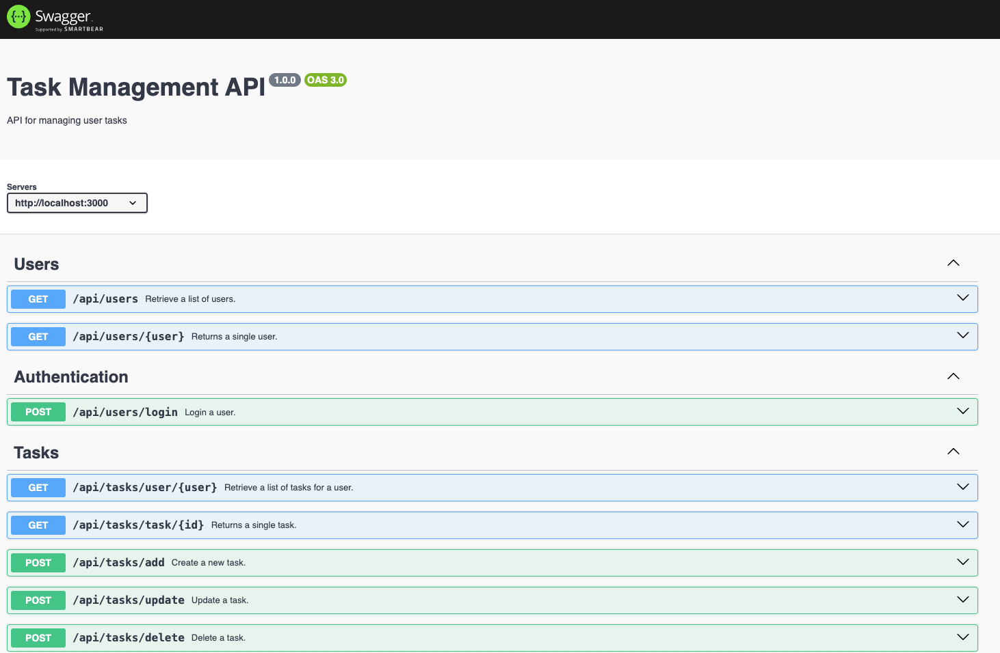

# **Rapid React Part 7: Integrating APIs**

In [Part 6](https://www.linkedin.com/pulse/rapid-react-part-6-passing-data-props-jonathan-gold-ullif/), we examined how to pass data between components with props (properties) and how to pass properties using ReactRouter’s location hooks. Currently, our React app performs a very simple authentication and displays a list of tasks. The data for these actions is stored in two Javascript files. This is great for demonstration purposes but has a number of limitations, such as we are working with limited data sets, and we can’t permanently add, modify, or delete data. In this installment, we will start to change this by integrating our React code with a Rest API. Specifically, we will update the Login and Tasks components to interact with a Task Management API. The sample code for this installment is available on [GitHub](https://github.com/trider/rapid-react-tutorial/tree/c6d28db3a7989a20a1a8a748729e3e7a2ce7c6ff/rapid-react-tutorial-06).

## **Key Concepts**

In this section, we explain side effects, ternary operators, and Cross-Origin Resource Requests.

### **Side Effects**

A side effect is an action or event that occurs outside of the scope of a component or function. While the result of a side effect does not return a specific response, such as a single value, object, or array, it will have broader impacts across the application. In our case, when a component responds to an event by sending a request or query that returns a response (value, object, or array). The response will modify the application state and rerender displayed data. These types of side effects are handled with the useEffect hook.

### **Ternary Operators**

Ternary Operators are a syntax for creating a conditional syntax. They provide a compact alternative to Javascript If-Else and switch statements and are used primarily, but not exclusively when rendering conditional components. The operator has the following syntax:

```javascript
condition ? expr1 : expr2
```

Where:

* condition: An expression that is evaluated as true or false
* expr1: This expression is executed if the condition is true
* expr2: This expression is executed if the condition is false

In the following example, we use a ternary operator to navigate to the Tasks page after a user is authenticated.

```javascript
{ user ?  navigate('/tasks', { state: { user:user } }) : null}
```

## **Cross-Origin Resource Requests**

Cross-Origin Resource Requests (CORS) is a web standard that provides protection for request-related security issues. CORS prevents web pages from making requests from a domain (address) other than the one from which the page was served. CORS can cause problems when developing a web application and could prevent you from accessing and displaying data. We will address one solution later in this article.

## **Task Management API**

The API we will work with was created for my tutorial series [Node JS Express for FrontEnd](https://www.linkedin.com/pulse/node-js-express-frontend-developer-complete-series-jonathan-gold-xvljf/?trackingId=NkGk3wxRRMOVCTQDlgpTFQ%3D%3D) developers. The API lets read, modify, and delete task data stored in a MongoDB database. The complete API code is described in [Part Eight: Documenting the API with Swagger](https://www.linkedin.com/pulse/node-js-express-frontend-developers-part-eight-documenting-gold-gkw4e/?lipi=urn%3Ali%3Apage%3Ad_flagship3_pulse_read%3BOzO%2Bep4dT%2ByYMnVu%2Fwllhw%3D%3D). This installment also provides a Swagger page that documents the API. You can read the series and download the sample code from the series [GitHub](https://github.com/trider/node-task-api-tutorial) repo. 



## **Authenticating Users**

We will start by modifying the Login component to authenticate a user’s credentials by sending an HTTP API request. Open src/pages/Login.js. In the FormBody component, add the following function.

```javascript
const FormBody = () => {
 const [email, setEmail] = useState("jonnygold@gmail.com");
 const [password, setPassword] = useState("1234");
 const [user, setUser] = useState();
 const navigate = useNavigate();
  const loginUser = (email, password) => {
   fetch('http://localhost:3000/api/users/login', {
    method: 'POST',
    headers: { 'Content-Type': 'application/json' },
    body: JSON.stringify({
    email: email,
    password: password
    }),
    })
   .then(response => response.json())
   .then(data => setUser(data))
   .catch(error => {
    console.error('Error:', error);
   });
 }
 ```

The function uses the fetch API provided by React to send a login request to the API. The request payload is populated with values from the Login form. If the user supplied valid credentials, the API returns their profile. When the response is received, the function calls setUser and uses the useState hook to update the component state.

Now, we need to update the component so that when the user presses the Submit button, the event handler calls the loginUser function.

Delete the current authentication code.

```html
<Form onSubmit={(e) => {
  const currUser = Users.find((user) =>
   user.email === email && user.password === password);
   if(currUser){
    setUser(currUser);
   }
   else{
    alert("Invalid email or password");
  }
}}

Replace it with this code:

<Form onSubmit={(e) => {
  e.preventDefault();
  loginUser(email, password);
}}>
```

## **Updating Application Routing and Handling CORS**

If you refresh the application and try to log in with valid credentials, nothing will happen. To ensure that the authentication process works, we must replace the BrowserRouter with a HashRouter. The BrowserRouter updates the page without reloading it. This causes issues if the loginFunction has not received a response from the API. As a result, the Tasks page is unable to load. You can avoid these issues by replacing the BrowserRouter.

Open App.js. Delete the current code, and replace it with the following.

```javascript
import "bootstrap/dist/css/bootstrap.min.css";
import { BrowserRouter, Routes, Route } from "react-router-dom";

import Login from "./pages/Login";
import Tasks from "./pages/Tasks";

function App() {
 return (
   <BrowserRouter>
    <Routes>
    <Route path="/" element={<Login />} />
    <Route path="/tasks" element={<Tasks />} />
    </Routes>
   </BrowserRouter>
 );
}
export default App;
```

As explained in the Key Issues section, the other issue that may prevent us from accessing the API is CORS. If you are using the Chrome browser on Mac OS, the easiest solution is to open a browser window that disables CORS protection. In your IDE’s integrated terminal, run the following code:

```bash
open -n -a /Applications/Google\ Chrome.app/Contents/MacOS/Google\ Chrome --args --user-data-dir="/tmp/chrome_dev_test" --disable-web-security --allow-running-insecure-content
```

If you refresh your browser, the Login component should work.

## **Displayed User Tasks**

Currently, our app displays all tasks and does not filter them by the authenticated user. Now, we can retrieve a specific user’s tasks via the API. However, in order to correctly update the Task component’s list of tasks, we must wrap the request with the useEffect hook. This is because the response must rerender the data displayed by the page.

As with all hooks, before we can use it, we must reference it. Open Tasks.js and update the first reference as follows:

```javascript
import React, { useState, useEffect } from 'react';

In Tasks, add a useEffect hook that contains the following request.

 useEffect(() => {
   fetch(http://localhost:3000/api/tasks/user/${user.user.userName})
    .then(response => response.json())
    .then(json => setData(json))
    .catch(error => console.error(error));
 });
 ```

To prevent errors if the page opens before it receives an authenticated user profile or no profile was provided, update the Tasks component functions return statement with a pair of ternary operators. Note how we can use the ternary operators to display a Loading indicator

```javascript
return (
<div>
 <NavbarComponent />
  <Container style={{ marginTop: "50px" }}>
 { user ?  <Info {...user} infoType='profile' variantInfo="info" /> : 'Loading...'}
 { tasks ? <TaskTable taskList={tasks} />  : 'Loading...'}
  </Container>
  …
   </div>
 );
```

Refreshing the page should display user-specific tasks provided by the Tasks API.

## **Conclusion and What’s Next**

In this installment, we introduced the concept of React side effects and how to handle them with the useEffect hook. We also described CORS and why it matters. Now, our app can interact with the Task Management API to authenticate users and add, modify, or delete data. In the next installment, we will look at how we can use React’s context API to pass data across our application.
