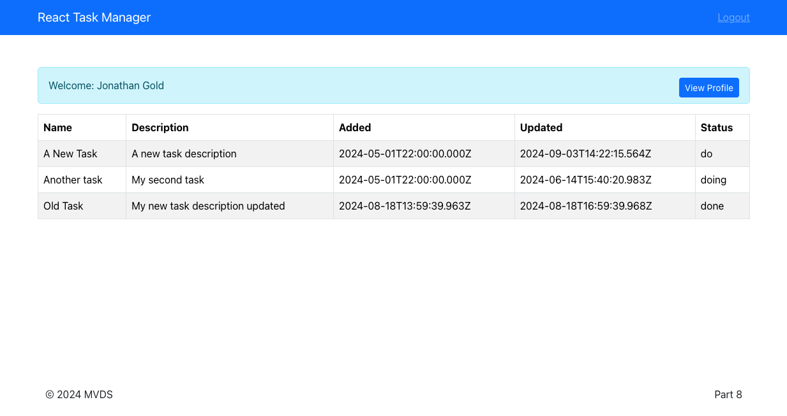

# **Rapid React Part 8: Passing Props with the Context API**

In [Part 7](https://www.linkedin.com/pulse/rapid-react-part-7-integrating-apis-jonathan-gold-5fgkf/), we introduced the concept of React side effects and how to handle them with the use effect hook. We integrated our app with a task management API. The Users component uses the API to authenticate user credentials. After the user is authenticated, the App navigates to the Tasks page. When the Tasks recieves an authenticated user profile, it retrieves tasks for that user to be displayed by the TasksTable component. The tasks are passed from parent to child component as props (properties). As we will explain in more detail, props work well for simple app, but as you create new features, components, and sub components, it becomes harder to keep track of how props are being passed between components. In this installment, we introduce React’s Context API and see how it can provide data across components. The sample code for this installment is available on [GitHub](https://github.com/trider/rapid-react-tutorial/tree/fbf38bf51b92e6661db907f27ace7b1575b4d04f/rapid-react-tutorial-07).

## **Key Concepts**

In this section, we explain the concepts of React Context and Providers

### **Context**

Our app is still relatively simple and has a shallow component tree. In other words, there at most two levels between our top level components so passing props between parent and child components, such as the Task component and its sub components (Nav, Info, Footer) works well. Over time we will add additional components and those in turn may be made up of multiple sub-component. Luckily, [React Context](https://react.dev/learn/passing-data-deeply-with-context) is designed to solve this problem by letting you share data with any component no matter its position within the component tree. React Context is a feature in the React library that enables components to share data (state, functions, or any value) without explicitly passing props through every level of the component tree.

### **Providers**

Providers are a special component that is used to provide context information to child components. The provider wraps child components and shares that data (props) with components at any level within the component hierarchy (tree).

## **Create Task Components**

To implement Context, we will create a group of task related components. These components will be used for providing task related context and to display user assigned tasks. In the src/components folder, create a new folder called Tasks. In the folder, create two files called TasksContext.js and TaskTable.js.


## **Adding Context and Providers**

Open TaskContext.js and add the following references. Apart from createContext, the other references should be familiar and were covered in previous installments.

```javascript
import { createContext, useState, useEffect } from 'react';
import { useLocation } from "react-router-dom";

We use the createContext hook to declare the our context called TasksContext.

export const TasksContext = createContext();

With these references in place, we can now create our tasks provider function (TasksProvider). Following the previous code, paste the following code:

export const TasksProvider = ({ children }) => {
 const [tasks, setTasks] = useState([]);
 const location = useLocation();
 const user = location.state;

 return (
   <TasksContext.Provider value={tasks}>
    {children}
   </TasksContext.Provider>
 );
};
```

The function provides the children parameters object. The hooks and related variables should look familiar and were described in depth in [Part 6: Passing Data with Props](https://www.linkedin.com/pulse/rapid-react-part-6-passing-data-props-jonathan-gold-ullif/). The function returns the TasksContext Provider and tasks retrieved from an API called and passes them onto the wrapped child component.

Next, in the middle of the function we add an useEffect hook function. While the code is similar to the code from [Part 7: Integrating APIs](https://www.linkedin.com/pulse/rapid-react-part-7-integrating-apis-jonathan-gold-5fgkf/). It has been implemented with the async and await keywords. These handle asynchronous calls to data sources and are more appropriate for generating context.

```javascript
useEffect(() => {
 const fetchTasks = async () => {
  try {
   const response
    await fetch(`http://localhost:3000/api/tasks/user/${user.user.userName}`);
    const data = await response.json();
    setTasks(data);
    } catch (error) {
    console.error('Error fetching tasks:', error);
    }};
   fetchTasks();
 });
 ```

## **Consuming Context**

Open TaskTable.js and paste the following code. The code is almost identical to the TaskTable we created in the previous installment with three differences. The first is a reference to the useContext hook. This enables the component to consume the context we declared in TasksContext.js. Next, we have a reference to the TaskContext.js file. The last difference is that the function’s task props has been replace by a tasks variable that is assigned data via the useContext hook from TasksContext.

```javascript
import { useContext } from 'react';
import { TasksContext } from './TasksContext';

import tableCols from "../../data/cols";
import Table from 'react-bootstrap/Table';

const TaskTable = () => {
 const tasks = useContext(TasksContext);
 return (
   <div>
    { tasks ? <Table striped bordered hover size="lg">
    <thead>
    <tr>{tableCols.map((col) => (<th key={col}>{col}</th>))}</tr>
    </thead>
    <tbody>
    {tasks.map((task) => (<tr key={task.id}>
    {tableCols.map((col) => (
    <td key={col}>{task[col.toLowerCase()]}</td>
    ))}
    </tr>))}
    </tbody>
    </Table> : 'Loading...'}
   </div>
 );
};
```

export default TaskTable;

## **Providing Context**

The last step is provide the context for the TaskTable Component. Open src/page/Tasks.js. Replace the existing code with the following:

```javascript
import { TasksProvider } from '../components/Tasks/TasksContext';
import { useLocation } from "react-router-dom";

import Container from 'react-bootstrap/Container';

import NavbarComponent from '../components/Navigation';
import Footer from '../components/Footer';
import Info from "../components/Info";
import TaskTable from '../components/Tasks/TaskTable';

const Tasks = () => {

 const location = useLocation();
 const user = location.state;

 return (
   <div>
    <NavbarComponent />
    <Container style={{ marginTop: "50px" }}>
    { user ?  <Info {...user} infoType='profile' variantInfo="info" /> : 'Loading...'}
    <TasksProvider>
    <TaskTable />
    </TasksProvider>
    </Container>
    <Container style={{ paddingTop: '20%' }} >
    <Footer />
    </Container>
   </div>
 );
}
```

export default Tasks;

At the top of the file is a reference to TasksProvider.js. The code removes the TaskTable component function and replaces it with a reference to the TaskTable component. In the return section, there is a TaskProvider Component that wraps the TaskTable component. Note that now there is now no need to define props to be passed to the child component. Refresh the page and everything should work with no noticeable changes.



## **Conclusion and What’s Next**

In this installment, we explained how to use the React Context API to pass prop data to child components. We then use the API to define Context and Providers and used them with our new TasksTable component. In the next, and final installment we will dive deeper into React state management and look and the theory and practice of Reducers.
