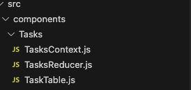
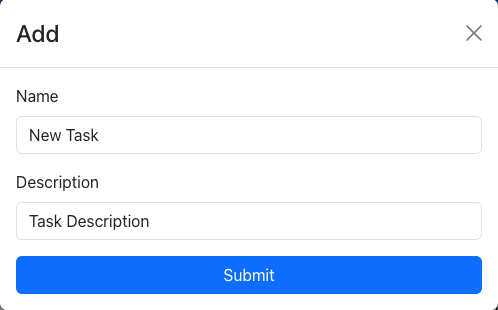
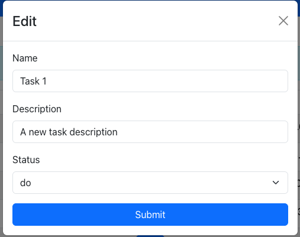
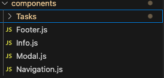
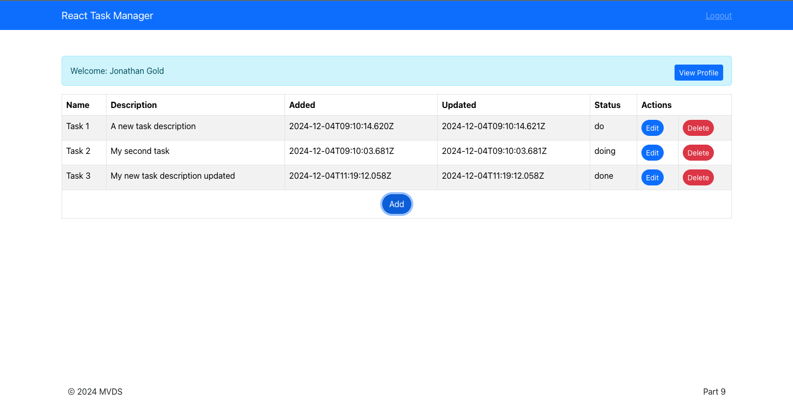

# **Rapid React Part 9: State Management with Reducers**

In [Part 8](https://www.linkedin.com/pulse/rapid-react-part-8-passing-props-context-api-jonathan-gold-oaqwe/), we explained how to use the [React Context API](https://react.dev/learn/passing-data-deeply-with-context) to share data without explicitly passing props through every level of the component tree. Props are one form of data or state managed within a React app. Currently, the state managed within our app is static; once retrieved it doesn’t change. As we explained in [Part 7: Integrating APIs](https://www.linkedin.com/pulse/rapid-react-part-7-integrating-apis-jonathan-gold-5fgkf/), and retrieving and displaying static data triggers side effects. A side effect is an action or event that occurs outside of the scope of a component or function that modifies the application state and rerenders displayed data. For example, when a user submits valid credentials via the Login page, a series of side effects are triggered. First, the app receives and stores an authenticated user profile. Second, it navigates to the Tasks page. Next, using the profile, it retrieves the user’s assigned tasks. Finally, it populates a table with the list of tasks. These side effects have predictable results that do not modify the application state in unexpected ways. As we start to modify our application’s state by adding, editing, and deleting tasks, things become more complex and unpredictable. In this installment, we look at how to manage the application state to ensure that any changes we make to our data do not have unexpected results. The sample code for this installment is available on [GitHub](https://github.com/trider/rapid-react-tutorial/tree/64e08c3f02570c121aaa4f7a708b7db0c878ae15/rapid-react-tutorial-09).

## **Key Concepts**

In this section, we explain the problem involved in managing state, how React resolves these issues with reducers, and how to access a reducer.

### **Managing State**

The simplest form of state management is declaring a variable and assigning it a value. This means that we can change or mutate the state whenever we want. The problem is that unless we are very careful, the mutated state can become corrupted over time and become meaningless. One way to prevent this is to replace mutable variables with unchangeable, immutable variables. Now we have a new problem we can’t make any changes. A common solution to this problem is instead of changing/mutating the state of a variable to create a new immutable copy.

### **Reducers**

A reducer manages an immutable state using pure functions. A pure function is a function that, when given the same input values, always returns the same result with no external side effects. In other words, a function that reliably generates predictable output and that does not change the state of other entities (components, functions, props, values, etc.). Here is a sample reducer that implements a pure function.

```javascript
const TasksReducer = (state, action) => {  
 switch (action.type) {  
  case 'add':  
    return [...state,{...action.task}];  
  default:  
    throw new Error(Unhandled action type: ${action.type});  
  }  
};
```

The reducer function has two parameters: state and action. The state argument is the current state of the application or component. In our example, state the list of tasks that we want to modify. The action arguments indicate the change to be performed on the state. In our example, the action object contains two properties: type and task. Within the function, there is a switch/case block that determines the response to each action type and how to manipulate the data associated with the action. When an action with a type field is set to add, the reducer returns a copy of the current state and appends a new task. The task data is provided within the action object’s task property.

### **Accessing Reducers**

You access a reducer with React’s useReducer hook. To access the TasksReducer, we create an area with two values tasks and dispatch and assign it to the referenced reducer. Tasks are the list of tasks assigned to the authenticated user. Dispatch sends an action object to the reducer. Here, dispatch is assigned two properties: action and task. The action property is set to add, and the task property is assigned an object with the task data.

```javascript
import{ useReducer } from 'react';  
import TasksReducer from './TasksReducer';

const TasksProvider = ({ children }) => {  
 const [tasks, dispatch] = useReducer(TasksReducer, []);  
 dispatch({ type: 'add', task: {  
   name: 'New Task',  
   description: 'A new task'  
 });  
};

## **Persisting the User Profile**

Before we create our reducer and update the context, we need to make a small change to the  Login component. Open src/pages/Login.js. Replace the FormBody function with the following code:

const FormBody = () => {

 const [email, setEmail] = useState("jonnygold@gmail.com");  
 const [password, setPassword] = useState("1234");  
 const [user, setUser] = useState(null);  
 const navigate = useNavigate();  
  const loginUser = async (email, password) => {  
   try {  
     const response = await fetch('http://localhost:3000/api/users/login', {  
       method: 'POST',  
       headers: { 'Content-Type': 'application/json' },  
       body: JSON.stringify({  
        email: email,  
        password: password  
       })  
     });  
     const data = await response.json();  
     setUser(data)  
     if(user)localStorage.setItem('user', JSON.stringify(user))

   } catch (error) {  
     console.error('Error adding task:', error);  
   }  
 }
 ```

The modified function ensures that the user profile is persisted to your browser’s localStorage. This ensures that if the profile props passed to the Tasks component are erased, the profile will continue to be available. Note that storing data in localStorage is highly insecure, and it is preferable to use other methods that store data in memory. This approach is used here for simplicity and convenience and to ensure that when a page is refreshed, the user profile is not lost.

## **Creating a Reducer**

In the src/components folder, create a new file called TasksReducer.js



Open the file and add the following code.

```javascript
const TasksReducer = (state, action) => {  
 switch (action.type) {  
  case 'set':  
    return action.tasks.filter(task => task.isActive);  
  case 'add':  
    return [...state,{...action.task}];  
  case 'edit':  
    return state.map((task) =>  
      task.taskId === action.task.taskId ? action.task : task  
    );  
  case 'delete':  
    return state.filter((task) => task.taskId !== action.task.taskId);  
  default:  
    throw new Error(Unhandled action type: ${action.type});  
  }  
};
```

export default TasksReducer

The reducer’s set action initializes the reducer’s state and populates it with the user’s assigned tasks. Note that the list of tasks is filtered by the isActive flag. This is because the Tasks API does not delete tasks from the Tasks database. Instead, the delete route sets the isActive flag to false. This enables users to reinstate deleted tasks. The add action appends the state with a new task. The edit action iterates through the tasks list and updates the modified task. The delete function removes the specified task by filtering the tasks list.

## **Accessing the Reducer through Context**

We will access TasksReducer and actions through TasksContext. In the file, we will modify the existing useEffect hook and add additional task management functions that will use the dispatch mechanism to set the action type field and an object that provides the required data.

Open src/component/tasks/TasksContext.js. At the top of the file, add a reference to the useReducer hook and another reference to TasksReducer.js.

```javascript
import{ createContext, useEffect, useReducer } from 'react';  
import { useLocation } from "react-router-dom";  
import TasksReducer from './TasksReducer';
```

In the TaskProvider function, update the variable declarations. The section now includes a reusable base URL (urlBase) variable with the path. There is an updated user variable declaration that can retrieve the user profile if user props are unavailable. The last variable declaration initializes the TaskReducer using the useReducer hook.

```javascript
export const TasksProvider = ({ children }) => {  
 const location = useLocation();  
 const urlBase = 'http://localhost:3000/api/tasks'  
 const user = location.state ? location.state:  JSON.parse(localStorage.getItem('user'))  
 const [tasks, dispatch] = useReducer(TasksReducer, []);  
 …  
};
```

Now, we will replace the useEffect hook’s fetchTacks function with the following updated code. Note how the function will only run if an authenticated user profile is available. The fetch command path variable has been modified to use urlBase. The last modification is the removal of the call to set tasks via the useState hook and replacing it with dispatching a new action to the reducer (dispatch). The action.type is assigned the value set, and a payload object called tasks is assigned the list of tasks assigned to the user.

```javascript
 useEffect(() => {  
   const fetchTasks = async (user) => {  
     try {  
       const response = await fetch(${urlBase}/user/${user.userName});  
       const data = await response.json();  
       dispatch({ type: 'set', tasks: data });  
     } catch (error) {  
       console.error('Error fetching tasks:', error);  
     }  
   };  
   if (user) fetchTasks(user);  
 },);
 ```

Following useEffect, we will add new state management functions, starting with addTask. Apart from the different API endpoints, HTTP command (POST), payload, and variable names, it is almost identical to the previous one. The most significant change is dispatch’s action.type is assigned now assigned task, and a single task is passed to the reducer.

```javascript
  const addTask = async (payload) => {  
   try {  
     const response = await fetch(${urlBase}/add, {  
       method: 'POST',  
       headers: { 'Content-Type': 'application/json' },  
       body: JSON.stringify(payload.task),  
     });  
     const taskAdded = await response.json();  
     dispatch({ type: 'add', task: taskAdded });  
   } catch (error) {  
     console.error('Error adding task:', error);  
   }  
 };
 ```

Next, we add the editTask function that enables the user to update a single task. This is almost an identical copy of addTask with minor changes.

 ```javascript
 const editTask = async (payload) => {  
   try {  
     const response = await fetch(${urlBase}/update/${payload.task.taskId}, {  
       method: 'POST',  
       headers: { 'Content-Type': 'application/json' },  
       body: JSON.stringify(payload.task),  
     });  
     const taskUpated = await response.json();  
     
     dispatch({ type: 'edit', task: taskUpated });  
   } catch (error) {  
     console.error('Error updating task:', error);  
   }  
 };
 ```

The deleteTask function deletes the task. The main difference is the payload sent to perform the function.

```javascript
 const deleteTask = async (payload) => {  
   try {  
     const response = await fetch(${urlBase}/delete, {  
       method: 'POST',  
       headers: { 'Content-Type': 'application/json' },  
       body: JSON.stringify({  
         taskId:payload.task.taskId  
       }),  
     });  
     const taskDeleted = await response.json();  
     
     dispatch({ type: 'delete', task: taskDeleted });  
   } catch (error) {  
     console.error('Error deleting task:', error);  
   }  
 };
 ```

Finally, we update TaskContext.Provider to enable external access to dispatch and task management functions.

```javascript
 return (  
   <TasksContext.Provider value={{ tasks, dispatch, addTask, editTask, deleteTask }}>  
     {children}  
   </TasksContext.Provider>  
 );  
};
```

## **Adding a Tasks Modal**

Before we update the TasksTable component with TasksContext’s state management features, we will add a TaskMangement modal. The component includes a Button that, when set to Add, displays:



Likewise, when set to Edit, the modal displays an additional field:



In src/components, add a new file called Modal.js.



Open the file and add references to React’s useState hook and Bootstrap’s Button, Modal, and Form components.

```javascript
import { useState } from 'react';  
import Button from 'react-bootstrap/Button';  
import Modal from 'react-bootstrap/Modal';  
import Form from 'react-bootstrap/Form';
```

Next, add an area called states that holds a list of task statuses.

```javascript
const states = ['do', 'doing', 'done'];
```

Now, we create the Modal component function and declare variables that will hold local state data from a form or that will be used to add and modify task data. This section also includes a function that hides or shows a menu depending on whether the user is adding or modifying the form.

```javascript
const ModalComponent = (props) => {

 const [taskName, setTaskName] = useState(props.task.name);  
 const [taskDescription, setTaskDescription] = useState(props.task.description);  
 const [dateAdded, setDateAdded] = useState(props.task.added);  
 const [dateUpdated, setDateUpdated] = useState(props.task.updated);  
 const [taskStatus, setTaskStatus] = useState(props.task.status);  
 const [show, setShow] = useState(false);

 const handleClose = () => setShow(false);  
 const handleShow = () => setShow(true);  
 const getMenu = () => {  
  if (props.title === 'Edit') {  
   return (  
       <Form.Group className="mb-3" controlId="taskStatus">  
         <Form.Label>Status</Form.Label>  
         <Form.Select onChange={(e) => setTaskStatus(e.target.value)}>  
           {states.map((state) => (<option key={state} value={state}>{state}</option>))}  
         </Form.Select>  
       </Form.Group>  
     )  
   }  
 }
 ```

In the function’s return section, we add a button that opens the modal. The name of the button will change according to the desired functionality.

```javascript
return (  
 <div >  
  <Button variant="primary" onClick={handleShow} className='rounded-pill' size={props.size}>  
    {props.title}  
  </Button>  
 </div>  
);  
}  
export default ModalComponent;
```

Following the button, we add the modal component. This includes probs and an event handler that closes the form. The Header section also displays the Modal’s title.

```javascript
<Modal show={show} onHide={handleClose}>  
 <Modal.Header closeButton>  
  <Modal.Title>{props.title}</Modal.Title>  
 </Modal.Header>  
   <Modal.Body>  
 </Modal.Body>  
</Modal>
```

In the Modal’s body section, add a form with the relevant fields for adding or editing tasks.

```javascript
<Form onSubmit={(e) => {  
 setDateAdded(new Date().toISOString());  
 setDateUpdated(new Date().toISOString());  
 if (props.title === 'Add') {  
  props.onAddTask({  
   name: taskName,  
   description: taskDescription,  
   user: props.task.user,  
   status: taskStatus,  
   taskId: props.task,  
   added: dateAdded,  
   updated: dateUpdated,  
   isActive: true,  
   isEdit: false  
  });  
 }  
 else if (props.title === 'Edit') {  
  props.onEditTask({  
   name: taskName,  
   description: taskDescription,  
   user: props.task.user,  
   status: taskStatus,  
   taskId: props.task,  
   added: dateAdded,  
   updated: dateUpdated,  
   isActive: true,  
   isEdit: false  
  });  
 }  
 setShow(false);  
}}>

 <Form.Group className="mb-3" controlId="taskName">  
  <Form.Label>Name</Form.Label>  
  <Form.Control   
    type="text"   
    value={taskName}  
    onChange={(e) => setTaskName(e.target.value)}  
   />  
 </Form.Group>  
 <Form.Group className="mb-3" controlId="taskDescription">  
  <Form.Label>Description</Form.Label>  
  <Form.Control   
   type="text"   
   value={taskDescription}   
   onChange={(e) => setTaskDescription(e.target.value)}  
  />    
 </Form.Group>  
 {getMenu()}  
 <div className="d-grid gap-2">  
  <Button variant="primary" type="submit" >Submit</Button>  
 </div>  
</Form>
```

## **Updating TasksTable**

All the pieces are now in place to add the new state management functionality to the TaskTable component. Open src/components/TaskTable.js, and at the top of the file, add the following references.

```javascript
import Button from 'react-bootstrap/Button';  
import ModalComponent from '../Modal';
```

In the TaskTable function, update TaskContext to reference the new task management functions. This will be followed by three new functions that will reference the functions and pass them as props to the Modal component. We also add a user variable that retrieves the current user profile from local storage.

```javascript
const TaskTable = () => {  
 const { tasks, addTask, editTask, deleteTask  } = useContext(TasksContext);  
 const onAddTask = (task) => { addTask({ task })}  
 const onEditTask = (task) => { editTask({task})}  
 const onDeleleTask = (task) => {deleteTask({task})}  
 const user = JSON.parse(localStorage.getItem('user'))
 ```

In the table header section, add a cell that spans two columns with the name Actions.

```javascript
 return (  
  <div>  
   {tasks ? <Table striped bordered hover size="lg">  
    <thead>  
      <tr>{tableCols.map((col, index) => (  
       <th key={col-${col}-${index}}>{col}</th>))}  
       <th colSpan={"2"}>Actions</th>  
      </tr>  
     </thead>
```

Let's update the table body so that each cell has a unique name. This prevents errors if a cell has a key based on a non-unique value.

```javascript
<tbody>  
 {tasks.map((task, key) => (  
  <tr key={task._id}>  
   {tableCols.map((col, index) => (  
    <td key={${task._id}-${col}-${index}-${task.added}}>  
     {task[col.toLowerCase()]}  
    </td>  
   ))}  
  </tr>  
 ))}
 ```

The next step is to add two cells to the row that let us add and delete tasks. The first cell references the Modal component. This component includes a button that opens the Modal to edit the task. The component properties include the task data and references to the calls to add and edit tasks.

```javascript
<td>  
 <ModalComponent   
  title='Edit'  
  size='sm'  
  task={task}  
  onAddTask={onAddTask}  
  onEditTask={onEditTask} />  
</td>  
<td>  
 <Button   
  variant="danger rounded-pill"  
  size='sm'  
  onClick={(e) => { onDeleleTask(task)}}  
  >  
  Delete  
 </Button>  
</td>  
```

Our final update is to add a row to the table that displays a button to create new tasks. The button is displayed by referencing the ModalComponent and sending the relevant props.

```javascript
<tr style={{ height: "40px" }}>  
 <td colSpan={tableCols.length + 2} style={{ backgroundColor: "white" }}>  
   <div className="d-grid gap-2 d-md-flex justify-content-md-center">  
    <ModalComponent  
     title='Add'  
     task={{  
      name: 'New Task',  
      description: 'Task Description',  
      user: user.userName,  
      status: 'do',  
      taskId: tasks.length + 1,  
      added: new Date().toISOString(),  
      updated: new Date().toISOString(),  
      isActive: true,  
      isEdit: false  
     }}  
     onAddTask={onAddTask}  
    />  
   </div>  
 </td>  
</tr>
```

Refresh the page, and it should look like this.



## **Conclusion and What’s Next**

In this installment, we completed our Task Management application. We started by introducing the theory and practice of React State Management. The first stage was to understand the difference between mutable and immutable data and the problems caused by mutating state. Then, we looked at how we can resolve these issues by using reducers and how to access reducers with context and providers. The rest of this installment dealt with how to create and use a reducer to manage state across our application. The final step was to add a user interface with buttons and modals to add, edit, and delete tasks. As with my previous series, I want to thank everyone who has viewed, responded, or commented on each article. I am currently working on some new ideas, including a possible series on other web development and related technologies. I am also investigating other ways of presenting and interacting with my existing material. I’ve really enjoyed working on this series, and it gave me a way to refresh and extend my knowledge of React. I hope that this knowledge is also beneficial to you. Thanks again, and see you all soon.
