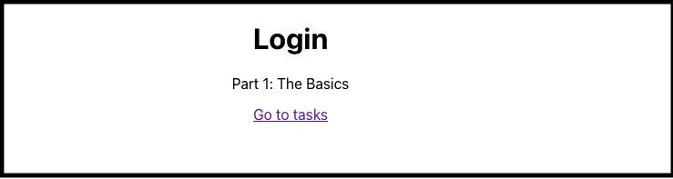

# ReactJS for Angular Developers Part 1: Routing

In a web application, routing refers to how a user navigates from point A to point B. In most cases, the user lands on the home page and clicks on a link to the page they are interested in. Once the target page is displayed, they can return to the home via the browser’s back button or explore links to other pages displayed on any page or through navigation elements, such as a top bar or side menu. 

## Objectives

In this article, we will build the foundations of our task management application. We will create two pages. The first is a placeholder Login page with a title and link to the application’s Home (Tasks) page. 



We will also create a placeholder Home page with a link to the Login page.


The React code for this app is available on GitHub at react-task-tutorial-01. Likewise, the Angular Code is Available from ng-task-tutorial-01.

## Routing in Angular

Since the release of Angular 2.0, routing in Angular is handled by a built-in routing component. While nobody forces you to use Angular routing, it’s fairly hard to build an Angular app without it. Once you achieve a basic understanding of Angular routing, you realize that routing is more than a navigation mechanism, it defines the structure of your application and provides a hierarchical map of how each part links together. In addition, Angular routing provides a mechanism that ensures only authorized users can access specific pages (AuthGuard), handles URL parameterization, and includes page metadata.

To illustrate the point, here is the Angular version of our pages. First, when we create our app with the Angular CLI, we will be asked if we want to include the Angular Router.

```bash
? Would you like to add Angular routing? Yes
```

After creating the Login and home components, we update each component’s .ts file to reference the RouterLink module.

```javascript
RouterLink module.
import { Component } from '@angular/core';
import { RouterLink } from '@angular/router';
@Component({
 selector: 'app-login', 
 standalone: true,
 imports: [ RouterLink ],
 templateUrl: './login.component.html',
 styleUrl: './login.component.scss'
})
export class LoginComponent {}
```

Next, we update each component’s HTML pages.

```html
<h1>Login</h1>
<p>Part 1: The Basics</p>
<p><a routerLink="/home">Home</a></p>
```

Once that’s done, we update our app-routing.module with the routes of each component and indicate the default page that will be opened on launch.

```javascript
import { NgModule } from '@angular/core';
import { Routes, RouterModule } from '@angular/router';
import { LoginComponent } from './login/login.component';
import { HomeComponent } from './home/home.component';


const routes: Routes = [
 { path: '', redirectTo: '/login', pathMatch: 'full' },
 { path: 'login', component: LoginComponent },
 { path: 'home', component: HomeComponent }
];


@NgModule({
 imports: [RouterModule.forRoot(routes)],
 exports: [RouterModule]
})
export class AppRoutingModule { }

```

## Getting Started

Now, let’s build the same application with React. Unlike Angular, there is no equivalent CLI. So, before we can get started, will need to install Create React App. Next, we need to create our React app with the create-react-app command.

```bash
npx create-react-app react-task-app
```

Next, we open the src/App.js and remove the boilerplate code.

```bash
import './App.css';
function App() {
 return (
   <div className="App"></div>
 );
}
export default App;
```

Now let’s create a folder called pages that contains two files Login.js and Tasks.js


Add the following code to Login.js.

```javascript
const Login = () => {
 return (
   <div>
     <h1>Login</h1>
     <p>Part 1: The Basics</p>
   </div>
 );
}


export default Login;
```

Next, update Tasks.js

```javascript
const Tasks = () => {
 return (
   <div>
     <h1>Tasks</h1>
     <p>TBD</p>
   </div>
 );
}


export default Tasks;
```

With the pages in place, we need to reference them from App.js.

```javascript
import Login from './pages/Login';
import Tasks from './pages/Tasks';
```

## React Routing

Once we have created our basic app, we can add Routing. Since React has no default router, we now install the React Router.

```bash
npm install react-router-dom
```

React Router includes a number of different Routers, but since our needs are pretty basic, we will use the BrowserRouter. This stores a link’s URL in the browser’s address bar and lets you navigate forward and backward to and from the page. In our App.js file, let’s add a reference to BrowserRouter. 

```javascript
import { BrowserRouter } from "react-router-dom";
To use the BrowserRouter, we must also define Routes and Route elements, so we will also need to reference these elements.
import { BrowserRouter, Routes, Route } from "react-router-dom";
```

Now we will need to add the Browser router to the App function with a child Routes object. We will define the Routes for each page.

```javascript
function App() {
 return (
   <div className="App">
     <BrowserRouter>
       <Routes>
         <Route path="/" element={<Login />} />
         <Route path="/tasks" element={<Tasks />} />
       </Routes>
     </BrowserRouter>


   </div>
 );
}
```

To navigate between pages, we will need to add a link object to each page. First, let’s update Login.js

```javascript
import {  Link } from "react-router-dom";
const Login = () => {
 return (
   <div>
     <h1>Login</h1>
     <p>Part 1: The Basics</p>
     <Link to="/tasks">Go to tasks</Link>
   </div>
 );
}
export default Login;
```

Next, we update Tasks.js.

```javascript
import {  Link } from "react-router-dom";


const Tasks = () => {
 return (
   <div>
     <h1>Tasks</h1>
     <p>TBD</p>
     <Link to="/">Go to login</Link>
   </div>
 );
}


export default Tasks;
```

The final step is to launch the App with NPM Start.
